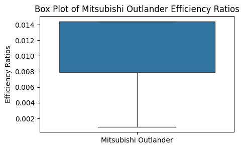
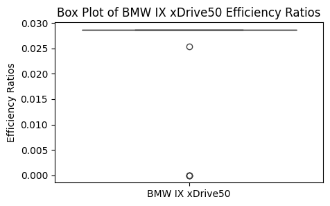

Analyzing Charging Efficiency Ratios of Electric Vehicles
===

Project Description
---
This project aims to analyze and compare the charging efficiency ratios of two different electric vehicles, the Mitsubishi Outlander and the BMW iXDrive 50, using real-world charging data (chose these two cars as they are on opposite sides of the spectrum in terms of cost). 

The goal is to determine if there is a statistically significant difference in their efficiency ratios and to provide insights into their performance on electrical distribution networks.

The analysis is conducted using a Jupyter Notebook, where data from an Excel file is loaded and pre-processed for statistical analysis. Normality checks, variance tests, and a two-sample t-test are performed to ensure the reliability of the comparisons and to identify significant differences.

Key Features
---
* Data Sources: Utilizes real-world charging data for the Mitsubishi Outlander and BMW iXDrive 50. - Obtained from Dataverse Harvard
* Analysis: Normality checks using the Shapiro-Wilk test, variance tests using Levene's test, and a two-sample t-test to compare efficiency ratios. This file is distribution_analysis.ibynb.
* Tools: Analysis performed using Python and Jupyter Notebook. Used Excel to format data and filter data.

Methodology
---
1. Data Collection: Efficiency ratio data for Mitsubishi Outlander and BMW iXDrive 50.
2. Normality Check: Shapiro-Wilk test to assess the normality of the data distributions.
3. Variance Testing: Levene's test to check for equal variances between the two groups.
4. Statistical Testing: Two-sample t-test to compare the means of efficiency ratios and assess statistical significance.
5. Visualization: T-distribution plot with the test statistic.

Findings
---
1. Shapiro-Wilk Test for Normality: Assessed the normality of the efficiency ratio distributions for both vehicles.
2. Levene's Test for Equal Variances: Checked if the variances between the two groups are equal.
3. Two-Sample t-Test:
t-statistic and p-value calculated to determine the significance of differences.
4. Visualization of the t-distribution with the test statistic.

Mitsubishi Outlander Box Plot Graph:
-

As you can see, the charging efficiency was not consistent.

BMW iX Drive 50 Box Plot Graph:
-

The BMW graph is much more consistent and has a higher efficiency ratio than the Mitsubishi.

Future Work
---
Future research could include:
* Alternative Statistical Methods: To account for any deviations from normality and enhance the robustness of the analysis.
* Granular Analysis: Investigating other factors affecting charging efficiency and their direct impacts on specific aspects of electrical grid performance. (Waveforms, tempature, area, etc.)

Acknowledgements
---
* Rishi Guharoy, Chantilly High School (Author)
* Mihir Kulshreshtha (Advisor)

References
---
Ziyat, Isla; Gola, Alia; Palmer, Patrick; Makonin, Stephen; Popowich, Fred, 2023, "EV-CPW: EV Charging Profiles and Waveforms", https://doi.org/10.7910/DVN/F81CXW, Harvard Dataverse, V1, UNF:6:5rKfaXacXvSFb7cTbE8a/g== [fileUNF]
